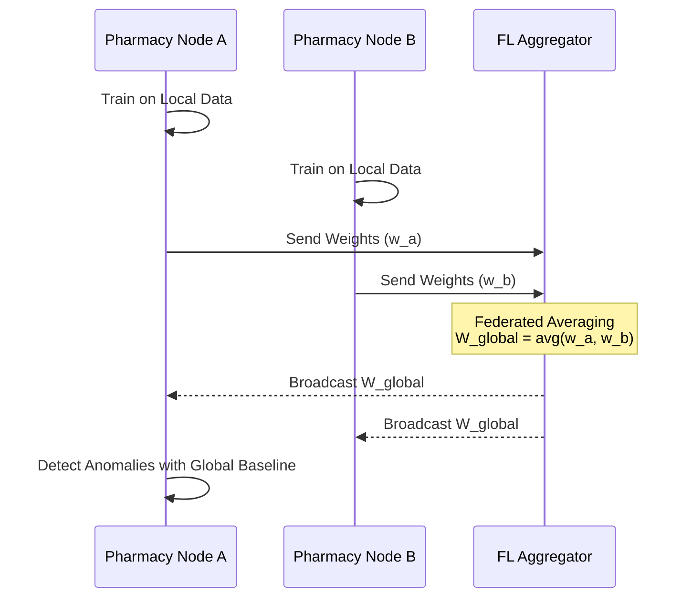

# Feature 5: Federated Anomaly Learning
**Status: Future Work / Technical Design**

This document outlines the design for expanding the Kush Medical System's anomaly detection from a single-shop scope to a multi-shop, network-wide capability using Federated Learning.

## 1. The Problem: Isolated Trust Boundaries
Currently, `anomaly_service.py` runs entirely within a single shop's trust boundary. It uses leave-one-out z-scores and Isolation Forests to detect statistically unusual price changes (rate history) or stock adjustments. 

However, this isolated view creates a blind spot: **distributed grey-market activity**.
If a grey-market distributor sells counterfeit or stolen stock at a 40% discount, but spreads these sales across 10 different pharmacies, each individual shop only sees a single transaction. To an isolated anomaly model, one low price might just skew the local baseline and evade detection (especially in low-volume scenarios), or look like a normal discount. A network-wide model would instantly see that this distributor's price is a drastic outlier compared to the global consensus rate for that medicine.

## 2. Why Raw Data Sharing Is Wrong
The obvious solution—centralizing all rate histories and stock ledgers in one big database—violates the core design principles of the system:
- **Competitive Sensitivity**: Shops will not share their exact cost prices (net rates) or supplier identities with competitors.
- **Customer Privacy**: Centralizing sales data leaks sensitive local health patterns.
- **Pillar 4 Scoping**: As established in `audit_service.py`, a single shop represents one trust boundary. The system intentionally avoids distributed consensus for local data. Any network sharing must maintain this strict data sovereignty.

## 3. The Federated Learning Approach
To solve the grey-market problem without compromising privacy, we propose a **Federated Learning (FL)** architecture.

Instead of sharing raw data, shops only share **model updates**.

### Architecture
1. **Local Training**: Each `PharmacyNode` trains a local anomaly detection model on its own private rate and batch data.
2. **Parameter Sharing**: Nodes send their calculated model weights (not the underlying data) to a central aggregator.
3. **Federated Averaging**: The aggregator combines the weights (e.g., via weighted averaging) to create a smarter global model.
4. **Redistribution**: The improved global model is sent back to all nodes, equipping each shop with network-wide anomaly detection capabilities.

### Important Technical Honesty: Model Selection
Currently, `anomaly_service.py` uses scikit-learn's **IsolationForest**. While excellent for isolated tabular data, tree-based models are *not naturally federation-friendly*. You cannot meaningfully "average" the branching structures of two decision trees trained on different data subsets. 

For the federated context, a simpler gradient-based model must be used for the shared component. A logistic regression outlier scorer or an autoencoder (where the weights can be numerically averaged via standard Federated Averaging) would be the more honest and technically sound choice. Individual shops could still run IsolationForest locally, using the federated model's output as an additional feature, rather than trying to federate the forest itself.

## 4. TrustChain Integration (Pillar 4)
Should each node's model update contribution be logged to the local TrustChain ledger? 

**Engineering Opinion**: Yes, this is a small, natural extension of the existing cross-shop event logging for accountability. Just as `network_service.py` logs `network_transfer_claimed` to prove multi-party commitments, logging a `federated_update_sent` event provides tamper-evident proof that a node participated honestly in the network model at a specific time. It is not overkill; it reuses the existing `audit_service.log_event` infrastructure perfectly.

## 5. Minimal Honest PoC for Demo/Viva
To demonstrate this concept without destabilizing the production application, we have provided a small, offline standalone Python script: `experiments/federated_anomaly_poc.py`.

This script uses only NumPy to simulate 3 pharmacies. It proves the mathematics of federated averaging: demonstrating how a global averaged weight can successfully flag a grey-market anomaly that slipped past a local model due to data skew. It is explicitly framed as a research prototype.

## 6. Realistic Scope and Effort Estimate
Implementing this in production is a multi-month, infra-heavy endeavor. The gap between the PoC and a live system includes:
- **Secure Aggregation Protocols**: Ensuring the aggregator cannot reverse-engineer weights into raw prices.
- **Network Reliability**: Handling offline nodes, dropped connections, and async weight updates.
- **Model Versioning**: Tracking which nodes are on which version of the global model.
- **Differential Privacy**: Injecting noise to prevent membership inference attacks.

This feature remains firmly in the "Future Work" phase.
